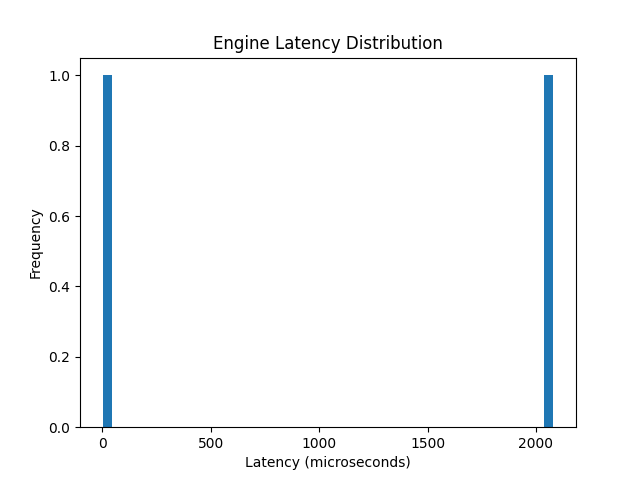
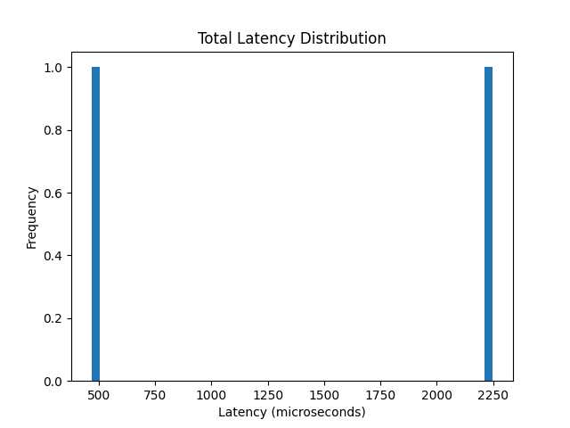
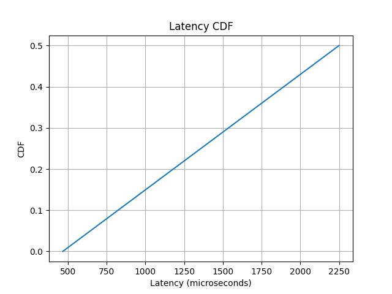

Low Latency Limit Order Book Simulator (C++)

A high-performance, latency-instrumented Limit Order Book (LOB) simulator built in C++, designed to model exchange-grade matching engines with microsecond-level precision and analyze system behavior under realistic trading workloads.

Overview

This project simulates a modern electronic trading system with:

Ultra-low latency order processing
Fine-grained latency instrumentation (ns/µs)
Tail latency (p50/p90/p99) analysis
Throughput benchmarking (orders/sec)
System-level performance insights

The system is designed to replicate core characteristics of real-world exchanges, including queuing delays, matching overhead, and bursty market traffic.

System Architecture

                +----------------------+
                |   Order Generator    |
                +----------+-----------+
                           |
                           v
                +----------------------+
                |  Network Delay Model |
                +----------+-----------+
                           |
                           v
                +----------------------+
                |   Ingestion Layer    |
                +----------+-----------+
                           |
                           v
                +----------------------+
                |   Order Book Engine  |
                |  (Price-Time Match)  |
                +----------+-----------+
                           |
                           v
                +----------------------+
                |   Trade Execution    |
                +----------+-----------+
                           |
                           v
                +----------------------+
                |   Metrics & Logger   |
                +----------------------+

Latency Instrumentation

Each order captures multiple latency components:

Metric	Description	Unit
network_us	Simulated network delay	µs
queue_ns	Time spent before matching	ns
engine_ns	Matching engine execution latency	ns
total_us	End-to-end processing latency	µs

All metrics are logged into a CSV file for offline analysis.

Performance Analysis
Metrics Computed
Median latency (P50)
Tail latency (P90, P99)
Latency distribution
Throughput vs latency
Latency CDF (tail risk visualization)

//image section
Visualization Outputs

Benchmark Results
Metric	Value
P50 Latency	~146 µs
P90 Latency	~861 µs
P99 Latency	~1128 µs
Throughput	~X orders/sec
Key Observations
Low median latency indicates efficient steady-state processing
Elevated tail latency (p99) driven by queueing delays
System exhibits realistic burst-sensitive performance
Matching engine latency remains consistently low
Performance Insights
Tail latency (p99) is a critical metric in trading systems
Queueing delays dominate latency under load
Cache locality significantly impacts matching performance
System behavior closely resembles real exchange dynamics
Core Features
Limit & Market Orders
Order Cancellation
Trade Tracking
Price-Time Priority Matching
Nanosecond-level profiling
CSV-based logging
Python-based analytics

Project Structure
limit-order-book-simulator/
│
├── src/
│   ├── main.cpp
│   ├── order_book.cpp
│   ├── order_book.h
│   └── order.h
│
├── analyze_latency.py
├── latency_log.csv
├── README.md

USAGE

ADD <id> <BUY/SELL> LIMIT <price> <quantity>
ADD <id> <BUY/SELL> MARKET <quantity>
CANCEL <id>
PRINT
TRADES
EXIT

Latency Analysis
python3 analyze_latency.py

Generates:

Latency histograms
Throughput vs latency plots
CDF curves
p50 / p99 metrics
Throughput Benchmarking

The system tracks:

Total orders processed
Execution duration
Orders per second

This enables evaluation of:

Latency vs Throughput trade-offs under load

Concurrent System Design (Proposed)
Thread 1: Order Ingestion
        ↓ (lock-free queue)
Thread 2: Matching Engine
        ↓
Thread 3: Logging & Metrics
Benefits
Decouples ingestion from processing
Reduces contention
Improves scalability under high load
Advanced Optimizations (Planned)
Cache-friendly price bucket structures
Lock-free queues (atomic operations)
Multi-threaded matching engine
Custom memory pool allocator
Real market replay simulation
In-engine percentile tracking
Resume Highlight

Built a high-performance limit order book simulator in C++ with nanosecond-level latency profiling; analyzed p50/p99 latency and throughput trade-offs under realistic burst traffic conditions.

Key Learnings
Tail latency dominates real-time system performance
Data structure choice critically affects latency
Realistic load simulation is essential for benchmarking
Systems must be optimized for both latency and throughput

Author
Tushar Yadav