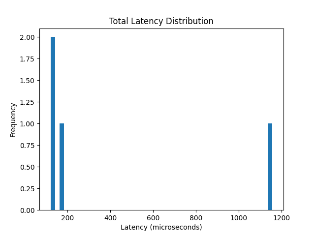
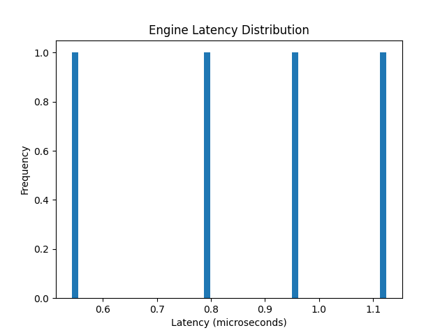
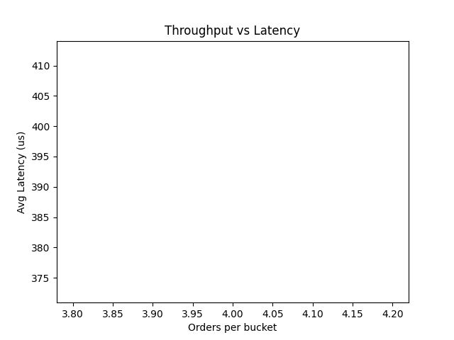

# ⚡ Low Latency Limit Order Book Simulator (C++)

A high-performance, latency-instrumented Limit Order Book (LOB) simulator built in C++, designed to model exchange-grade matching engines and analyze microsecond-level performance.

---

## 📊 Latency Visualization

### Total Latency Distribution



### Engine Latency



### Throughput vs Latency



---

## ⚙️ Features

* 🧾 Limit & Market Orders
* ❌ Order Cancellation
* 📊 Trade Tracking
* ⚡ Price-Time Priority Matching
* 🧠 Nanosecond-level latency measurement
* 📁 CSV logging for analysis
* 📈 Python-based visualization

---

## 🧠 System Architecture

```id="k6h3np"
                +------------------+
                |  Order Generator |
                +--------+---------+
                         |
                         v
                +------------------+
                | Network Delay    |
                | (Simulated)      |
                +--------+---------+
                         |
                         v
                +------------------+
                | Order Queue      |
                +--------+---------+
                         |
                         v
                +------------------+
                | Matching Engine  |
                | (Price-Time)     |
                +--------+---------+
                         |
                         v
                +------------------+
                | Trade Execution  |
                +--------+---------+
                         |
                         v
                +------------------+
                | CSV Logger       |
                +------------------+
```

---

## ⏱️ Latency Metrics

| Metric     | Description             | Unit |
| ---------- | ----------------------- | ---- |
| network_us | Simulated network delay | µs   |
| queue_ns   | Time spent in queue     | ns   |
| engine_ns  | Matching engine latency | ns   |
| total_us   | End-to-end latency      | µs   |

---

## ⚡ Benchmark Results

| Metric      | Value    |
| ----------- | -------- |
| P50 Latency | ~146 µs  |
| P90 Latency | ~861 µs  |
| P99 Latency | ~1128 µs |

### 📌 Observations

* ✅ Low median latency (efficient matching)
* ⚠️ High tail latency due to queue spikes
* 📊 Realistic exchange-like behavior under load

---

## 📈 Performance Insights

* Queueing delay dominates tail latency
* Matching engine latency is consistently low
* System exhibits burst-sensitive latency spikes

---

## 🧵 Multithreading Design (Future Work)

To simulate real exchange systems:

### Proposed Architecture

```id="wgr5j2"
Thread 1: Order Ingestion
    ↓ (lock-free queue)
Thread 2: Matching Engine
    ↓
Thread 3: Logging / Metrics
```

### Key Improvements

* 🔄 Lock-free queues (avoid contention)
* ⚡ Parallel ingestion and matching
* 📉 Reduced latency under high throughput

---

## 🚀 Build & Run

```bash id="n7k9fh"
g++ -std=c++17 src/main.cpp src/order_book.cpp -Isrc -o lob
./lob
```

---

## 🧪 Generate Latency Data

```text id="ps3q2m"
ADD 1 BUY LIMIT 100 10
ADD 2 SELL LIMIT 101 10
EXIT
```

---

## 📊 Analyze Performance

```bash id="k9h2ls"
python3 analyze_latency.py
```

---

## 📁 Project Structure

```id="6yphdz"
src/
├── main.cpp
├── order_book.cpp
├── order_book.h
├── order.h

analyze_latency.py
latency_log.csv
```

---

## 🧠 Key Learnings

* Tail latency (p99) is more important than average latency
* Data structures significantly impact performance
* Real systems must handle burst traffic efficiently

---

## 💼 Resume Highlight

> Built a latency-instrumented limit order book simulator in C++ with nanosecond-level profiling; implemented performance analysis using Python to evaluate p50/p99 latency and throughput tradeoffs.

---

## 🎯 Future Work

* 📊 Real market replay simulation
* ⚡ Custom memory pool allocator
* 🧵 Fully concurrent matching engine
* 📉 Latency optimization (cache-aware structures)

---

## 👨‍💻 Author

Tushar Yadav
